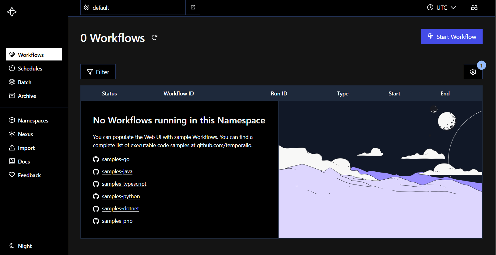
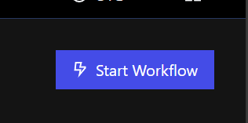
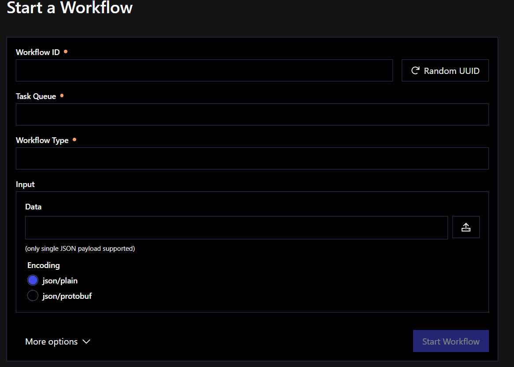
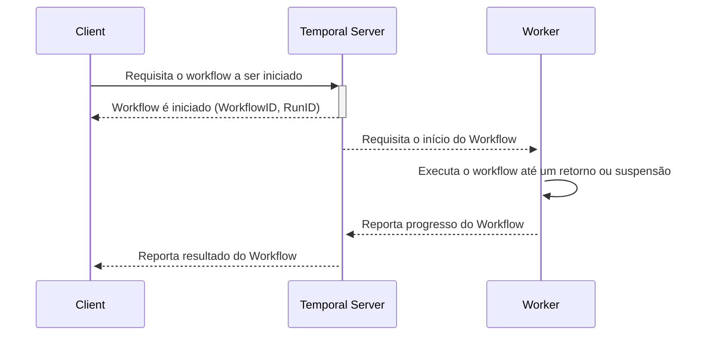

# O que é e qual o propósito do Temporal?


---
Objetivos dessa aula:

- Entender o que é o Temporal e qual seu propósito
- Mostrar as nomeclaturas do Temporal (Workers, workflows, activities, etc.)
- Iniciando o Temporal a partir de um docker compose
- Iniciando o SDK do Temporal com Typescript
- Execução do primeiro "Hello, World!" com Temporal, usando Workflows e Activities
---

Nesta aula, iniciaremos nossa jornada no entedimento do Temporal e na construção de uma Worker rodando de verdade. Partiremos do início: principais dores que as empresas tem, motivo das empresas utilizarem Temporal.io, o que ele facilita na vida do desenvolvedor e principais nomeclaturas que precisamos entender para iniciar.

Após isso, configuraremos o ambiente do Temporal utilizando o docker-compose, mostrando a UI do Temporal Server. Em seguida, mostrarei como montar um ambiente apropriado para criar um worker utilizando o Temporal SDK do Typescript. E então, finalmente, criaremos nosso primeiro "Hello, World!" a partir de um Workflow.

## Propósito do Temporal

O Temporal é uma plataforma de orquestração de execuções distribuídas e duráveis que permite o desenvolvimento de aplicações resilientes e escaláveis. Ele fornece um modelo baseado em workflows para gerenciar tarefas assíncronas, garantindo confiabilidade, consistência e tolerância a falhas sem que nós, pobres desenvolvedores, precisemos lidar com complexidades como retries, timeouts e recuperação de falhas NA MÃO.

O principal propósito do Temporal é simplificar a construção de sistemas distribuídos ao fornecer uma maneira fácil de definir quais execuções devem ser realizadas. O servidor do Temporal gerencia essas execuções, garantindo que tarefas sejam concluídas mesmo em cenários de falha, reinicialização ou indisponibilidade temporária dos serviços.

Vamos imaginar então que somos uma fintech que processa pagamentos para lojistas e precisamos garantir que todas as transações sejam concluídas com sucesso. Mas de vez em quando quando ninguém está olhando, final de semana, ocorrem falhas na comunicação com o banco ou então o sistema trava antes de confirmar a transação.

Usando Temporal, nossa empresa pode garantir que cada pagamento **SERÁ** concluído, mesmo se houver falha no sistema ou reinicialização do servidor. A execução do Temporal retomará a transação do ponto de falha, retentando só a parte que deu falha e seguindo o resto da execução normalmente, sem risco de pagamentos duplicados ou não processados. Isso é o que a gente busca atacar: garantia de execução como se nada tivesse acontecido.

## Nomeclaturas importantes

### Activities

Uma Activity é o ponto mais simples disso tudo, ela é basicamente apenas uma função ou uma tarefa que faz parte de um Workflow. Normalmente, são operações que envolvem chamadas externas, como acessar um banco de dados, enviar um e-mail ou chamar uma API.

Quando desenvolvendo Activities, projete elas imaginando que elas  podem falhar, mas que o Temporal automaticamente vai gerenciar as retries e timeouts para garantir que sejam concluídas.

### Workflows

Um Workflow no Temporal é a unidade principal de orquestração de processos. Ele define um fluxo de execução que pode incluir várias etapas e chamadas assíncronas. Os Workflows podem pausar e continuar do ponto onde pararam, mesmo após falhas ou reinicializações do sistema.

Pense em um Workflow como uma passo-a-passo das Activities. Quando ele for montado, ele deve ser imaginado como um processo que precisa ser recomeçado todo do zero em caso de falha.

### Workers

Um Worker no Temporal é, de forma simples de se explicar, o nosso código. Ele é responsável por registrar no Temporal Server os nossos Workflows e Activities. Ele deve possuir um ID específico chamado **task-queue** que gerará uma fila no Temporal Server em que Workers idênticos (como no caso de necessário escalar réplicas por exemplo) poderão se inscrever. A task-queue é gerada quando você conecta o Worker ao Temporal Server.

Nele há uma série de configurações que poderão ser abordados no futuro, mas trabalharemos primeiro com o básico para não nos embaralharmos muito.

*PS: Workers só podem ser registrados se eles possuirem ao menos uma Activity*

### Namespaces
Um Namespace no Temporal é uma área separada onde todos os componentes operam de maneira isolada, permitindo que diferentes aplicativos ou serviços dentro do mesmo cluster do Temporal não interfiram entre si. Eles são separados por nomes diferentes. Nesse curso, não vamos nos aprofundar em namespaces, pois usaremos a auto-gerada.

### Temporal Server
É o serviço a parte onde tudo se conecta. Ele é composto por um serviço que possui um frontend para termos observabilidade sob nossos Workflows, o serviço interno que nos conectamos para registrar nossos namespaces e workers, além de um elasticsearch e o seu próprio banco de dados (por padrão, um postgres).

### Client
Um Client no Temporal é qualquer serviço ou aplicação que interage com o Temporal Server para iniciar e monitorar Workflows e executar Activities. Ele é responsável por enviar comandos para o servidor e buscar respostas sobre a execução de workflows. Ele pode ser:

- Uma API com um SDK do Temporal Client instalado;
- O próprio CLI do temporal
- A própria UI do Temporal Server 

---

## Instalando o Temporal Server com docker compose

Há várias formas de instalar o Temporal na sua máquina, mas aqui trabalharemos de forma prática. O pessoal da Temporal Technologies criou para nós um simples `docker compose`.

```sh
# Baixa o repositório `docker-compose` da `temporalio`.
git clone https://github.com/temporalio/docker-compose.git
# Entra na pasta
cd docker-compose
# Instala as dependências e inicia o Temporal
docker compose up -d
```

Quando o processo finalizar, basta acessar a rota `http://localhost:8080/` e você terá acesso ao **Temporal Server**. Certifique-se de que as portas `8080` e `7233` estão liberadas para que o servidor possa iniciar corretamente. Você terá acesso a uma tela como essa:

{ .shadow}

Por enquanto, não exploraremos muito ela, mas ai estará a nossa maior visibilidade e observabilidade que o Temporal nos proporciona.
O que precisamos saber:

- Na porta `8080` encontra-se a UI do Temporal Server, onde podemos ter um maior controle sobre o que se passa no backend.
- Na porta `7233` encontra-se o backend de conexão com o Temporal Server. É nele que nossas aplicações se conectarão.

## Criando o nosso primeiro Worker

Com tudo em ordem, vamos criar um worker simples utilizando o SDK do Typescript para Temporal. Realizaremos os seguintes comandos:
```sh
mkdir meu-primeiro-worker && cd meu-primeiro-worker
npm init -y
npm install typescript tsx @temporalio/worker @temporalio/workflow
mkdir workflows
touch index.ts workflows/index.ts
```

O que eles fazem?
Criam uma estrutura de pastas como essa:

```
.
├── workflows
│  └── index.ts
├── node_modules/
├── package.json
├── package-lock.json
└── index.ts
```

No nosso `./workflows/index.ts`, adicionaremos nosso primeiríssimo Workflow! Ele será algo inicialmente bem básico mas que servirá ao nosso propósito:

```typescript
export async function helloWorldWorkflow() {
    return 'Hello World!'
}
```


E agora no nosso `./index.ts` da nossa pasta raiz, adicionaremos o seguinte código:
```typescript
import { NativeConnection, Worker } from '@temporalio/worker';

async function run() {
  // Inicia uma conexão nativa com o Temporal Server
  const connection = await NativeConnection.connect();
  try {
    // Cria um Worker com task-queue `hello-world` que exportará nosso helloWorldWorkflow para a rede do Temporal Server
    const worker = await Worker.create({
      connection,
      taskQueue: 'hello-world',
      workflowsPath: require.resolve('./workflows'),
    });

    // Se conecta com o Temporal Server e executa o worker
    await worker.run();
  } finally {
    await connection.close();
  }
}

run().catch((err) => {
  console.error(err);
  process.exit(1);
});
```
Nosso Worker já está corretamente conectado e aguardando o Temporal Server atribuir alguma tarefa a ele!

## Executando nosso primeiro Workflow

Com todo o ambiente preparado, voltaremos para nosso Temporal Server na porta `http://localhost:8080/`, e buscaremos o botão `Start Workflow`:
<br />

<br />

Ao clicar, será aberto um formulário para o Temporal Server saber qual é o workflow que deve ser iniciado, em qual task-queue, que ID único atribuiremos àquele workflow e quais dados iremos passar como atributos de inserção.



Para nosso primeiro workflow:

- Workflow ID:     `meu-primeiro-workflow`
- Task Queue:      `hello-world`
- Workflow Type:   `helloWorldWorkflow`
- Input/data:      ## Deixe vazio

Em seguida, clique em `Start Workflow` e retorne à `http://localhost:8080/`. Você verá que nosso primeiro workflow foi corretamente executado! Mas como isso aconteceu?



## Conclusão
Pronto! Agora temos um ambiente de desenvolvimento totalmente configurado para começar a trabalhar com Temporal.io e com nosso Worker com SDK Typescript e já fizemos nossa primeira execução de um workflow. Na próxima aula nos aprofundaremos na estruturação do nosso Worker. Até lá!